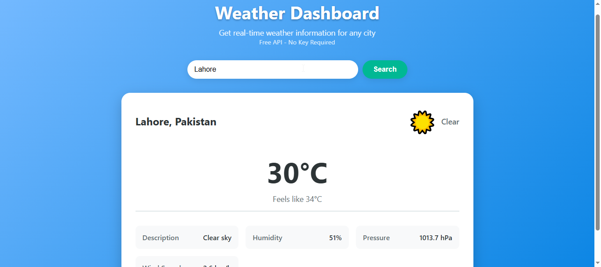

A modern, responsive weather application built with React and Vite that provides real-time weather information for any city worldwide.

---


---

### 📑 Table of Contents
- [Tech Stack](#-tech-stack)
- [How to Use](#-how-to-use)
- [Screenshots](#-screenshot)
- [Features](#-features)
- [Roadmap](#roadmap)
- [Contributing](#-contributing)
- [License](#-license)
- [Contact](#-contact)

---

### 🚀 Tech Stack


---

### 📂 How to Use
1. Clone the repo
   ```bash
   git clone https://github.com/Muzammil-Frontend-Web-Projects/NFT-Gallery-With-React-Js.git
   ```
2. Navigate to the project folder
   ```bash
   cd Weather-Dashboard-App-with-React-js
   ```
3. Install dependencies
   ```bash
   npm install
   ```
4. Start development server
   ```bash
   npm run dev
   ```
5. Open your browser
   Navigate to http://localhost:3000 to view the application


---

### 📸 Screenshot
| Screenshot |
|-----------|
|

---

### ✨ Features

-🔍 City Search - Get current weather for any city
-📱 Responsive Design - Works perfectly on desktop, tablet, and mobile
-🎨 Modern UI - Clean, minimalist interface with smooth animations
-⚡ Fast Performance - Built with Vite for optimal loading speeds
-🌍 Global Coverage - Weather data for cities worldwide
-🎯 Accurate Data - Real-time temperature, humidity, pressure, and wind information

<details> <summary>📌 Key Highlights</summary>
Instant City Lookup: Enter any city name worldwide for immediate weather data
<br>
Real-time Updates: Get current weather conditions with live data
<br>
Geolocation Support: Automatic city detection and weather fetching
<br>
Multi-language Support: Works with cities in any language
</details>

---

### Roadmap

- [ ] **Extended Forecast** - Add 7-day weather forecast with daily predictions
- [ ] **Weather Maps** - Integrate interactive weather maps with precipitation radar
- [ ] **Multiple Locations** - Save and switch between favorite cities
- [ ] **Weather Alerts** - Real-time severe weather notifications and warnings
- [ ] **Progressive Web App** - Add PWA capabilities for offline functionality
- [ ] **Advanced Caching** - Implement smart caching for faster load times
- [ ] **Background Sync** - Automatic weather updates in the background
- [ ] **Performance Optimization** - Code splitting and lazy loading components

---

### 🤝 Contributing

Contributions, issues, and feature requests are welcome!  
Feel free to fork this repository and submit pull requests.

---

### 📜 License
This project is licensed under the [MIT License](./LICENSE).

---

### 📬 Contact
 [](mailto:cornerofcodes00@gmail.com)
[](https://www.linkedin.com/in/muhammad-muzammil-irshad-05b863333)
[](https://www.tiktok.com/@cornerofcodes)

---

<p align="center">Made with ❤️ by Muzammil Irshad with Appverse Technologies</p>
